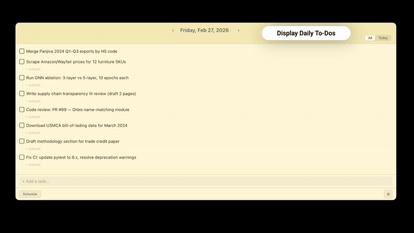

# Sticky Todo

Cross-platform sticky note todo planner with AI task breakdown.

## Install

Download the latest installer from [Releases](https://github.com/2Mars4096/todo-sticky/releases):

| Platform | File |
|----------|------|
| **macOS** (Intel + Apple Silicon) | `.dmg` |
| **Windows** | `.msi` or `.exe` |
| **Linux** | `.deb` or `.AppImage` |

On first launch the app opens a settings panel:

| Field | What to enter |
|-------|---------------|
| **Provider** | Choose **OpenAI**, **Anthropic (Claude)**, **Google Gemini**, or **Custom** (any OpenAI-compatible endpoint). Base URL and model suggestions auto-fill. |
| **API Base URL** | Pre-filled for standard providers. Edit if you use a proxy, Azure, OpenRouter, etc. |
| **Model** | Pick from suggestions or type any model name (e.g. `gpt-4o`, `claude-sonnet-4-20250514`, `gemini-2.0-flash`). |
| **API Key** | Paste your key. Stored locally — never sent anywhere except your chosen API. |
| **KB Path** | Where task files live (`content/to-do/` inside this folder). Default: `~/Documents/Sticky Todo`. |
| **Machines** | *(Optional)* Add servers/workstations for AI scheduling. |

Click **Test Connection** to verify, then **Get Started**. Change settings later via ⚙.

> macOS Gatekeeper may warn about an unsigned app. Right-click → **Open** to bypass.

## Demo

<p align="center">
  
</p>

## Features

- **Tasks & subtasks** — Add tasks, break them into subtasks manually or with AI
- **Status cycle** — Toggle task status: todo → done → partial → todo
- **Push to tomorrow** — Move unfinished tasks to the next day
- **Date navigation** — Jump between days with prev/next arrows or calendar picker
- **View modes** — **All** shows subtasks from other dates; **Today** shows only today's subtasks
- **AI breakdown** — One-click breakdown of a task into actionable subtasks (requires LLM API)
- **AI schedule** — Generate a time-blocked schedule for the day (requires LLM API)
- **File sync** — Tasks stored as Markdown in `content/to-do/`; edits sync both ways
- **Always on top** — Sticky window stays visible; runs in menu bar with tray icon
- **Lightweight** — Built with Tauri; ~5 MB installer (no bundled browser)

## Development

```bash
# Prerequisites: Node.js 18+, Rust (https://rustup.rs)

npm install
npm run dev
```

This starts Vite on port 5173 and launches the Tauri window.

| Command | Description |
|---------|-------------|
| `npm run dev` | Start app (Vite + Tauri) |
| `npm run dev:vite` | Vite-only (no native window) |
| `npm run build` | Build distributable for current platform |
| `npm run release` | Bump patch version, tag, and push (triggers CI) |

## Releasing

Releases are automated via GitHub Actions. To publish a new version:

```bash
npm run release        # bumps patch (2.0.0 → 2.0.1), creates tag, pushes
# or manually:
npm version minor      # 2.0.0 → 2.1.0
git push --follow-tags
```

The workflow builds for **macOS** (universal binary), **Windows**, and **Linux**, then uploads them as a **draft** GitHub Release. Go to [Releases](https://github.com/2Mars4096/todo-sticky/releases) to review and publish.

## Shortcuts

| Shortcut | Action |
|----------|--------|
| **⌥⌘T** / **Ctrl+Alt+T** (Windows) / **Ctrl+Shift+Alt+T** (Linux) | Show/hide window (global) |
| **Enter** | Add task / submit subtask / commit edit |
| **Escape** | Cancel edit or subtask input |
| **Double-click** | Edit task text |
