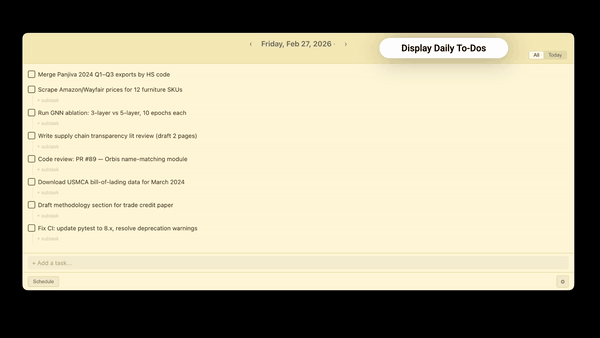

# Sticky Todo

Cross-platform sticky note todo planner with AI task breakdown.

## Install

Download the latest installer from [Releases](https://github.com/2Mars4096/todo-sticky/releases):

| Platform | File |
|----------|------|
| **macOS** (Intel + Apple Silicon) | `.dmg` |
| **Windows** | `.msi` or `.exe` |
| **Linux** | `.deb` or `.AppImage` |

On first launch the app opens an optional setup panel. Choose **Start without AI** to begin immediately, or configure a provider to enable AI task breakdown and day planning:

| Field | What to enter |
|-------|---------------|
| **Provider** | Default is **Moonshot (Kimi)**. Choose **Codex (ChatGPT login)** to use the locally authenticated Codex CLI without an API key, or select OpenRouter, OpenAI, Anthropic, Gemini, or a custom OpenAI-compatible endpoint. |
| **API Base URL / Codex Executable** | API providers receive their standard endpoint. Codex uses `codex` with common install paths auto-detected; enter a full executable path if needed. |
| **Model** | Pick an API model, or leave the Codex model blank to use the CLI default. OpenRouter accepts catalog slugs such as `moonshotai/kimi-k3`; the direct Moonshot default remains `kimi-k2.6`. |
| **API Key** | Required only for API providers. Codex reuses the existing local `codex login` session and does not store another credential in Sticky Todo. |
| **KB Path** | Where task files live (`content/to-do/` inside this folder). Default: `~/Documents/Sticky Todo`. |
| **Machines** | *(Optional)* Add servers/workstations for AI scheduling. |

On macOS, the default task folder and local app-state folder stay anchored to the signed-in account, so launching Sticky Todo from an installer or automation tool cannot silently open a separate empty data store.

If macOS or Dropbox has offloaded the Markdown archive, Sticky Todo reports **Tasks are waiting in Dropbox** instead of treating the archive as empty or waiting forever. Reveal the configured `content/to-do/.../index.md` file in Finder, choose **Make available offline** or **Download now**, then use **Retry** after the file becomes local.

Click **Test Connection** to verify, then **Save & Start**. Change settings later via ⚙.

After configuring more than one provider, use the compact provider selector beside ⚙ to switch in one action. Each provider keeps its own API URL, key, and last-used model. Choosing an unconfigured provider opens Settings directly on that provider.

> macOS Gatekeeper may warn about an unsigned app. Right-click → **Open** to bypass.

## Demo

<p align="center">
  
</p>

## Features

- **Tasks & subtasks** — Use distinct add and branching controls for manual steps or AI-generated breakdowns; drag the six-dot handle to reorder tasks or steps within one task
- **Ready-to-use compact shell** — Task capture opens at the top, side tools stay collapsed by default, and compact panels overlay instead of squeezing the task list
- **Predictable launch placement** — Fresh launches open at the top-right of the current display with a safe screen-edge margin; after that, the app respects wherever you drag it
- **Status cycle** — Toggle task status: todo → done → partial → todo
- **Smart carry-forward** — Move unfinished past work directly to today; tasks on today or a future date move to their following day
- **Date navigation** — Jump between days with fixed-position prev/next arrows and a centered calendar label; empty past/future dates offer a direct return to today
- **Native clipboard** — Use standard Command-C and Command-V in editable task text with no dedicated clipboard buttons; the Prompt action still copies an execution-ready brief for Codex and other agents
- **Agent task API** — Extract, create, edit, and delete Markdown-backed tasks from reusable skills through a local JSON CLI, with revision checks for safe writes
- **View modes** — **All** shows subtasks from other dates; **Today** shows only today's subtasks
- **AI breakdown** — One-click breakdown of a task into actionable subtasks (requires a configured AI provider)
- **AI schedule** — Generate a time-blocked schedule for the day (requires a configured AI provider)
- **Codex background provider** — Run breakdowns, schedules, and album picks through the locally authenticated Codex CLI in an ephemeral read-only workspace, without adding an OpenAI API key
- **Task-aware albums** — Turn the current task list into a four-album work soundtrack, with a concise fit and best-use cue for each pick (requires a configured AI provider)
- **Star Focus Mission Control + Focus Mode** — Arm a task, choose a focus burn, and travel one leg at a time through an Earth → Moon → Venus → Mars → Saturn route. The compact layout puts the task and timer first; wider windows pair those controls with the interactive 3D Tracking Station. Completed sessions become a native-local travel log with `6` / `12` / `24` retention presets, while the right rail stays lightweight and always shows the next destination.
- **File sync** — Tasks stored as Markdown in `content/to-do/`; edits sync both ways
- **Always on top** — Sticky window stays visible; runs in the menu bar with a tray icon
- **Lightweight** — Built with Tauri; ~5 MB installer (no bundled browser)

## Development

```bash
# Prerequisites: Node.js 18+, Rust (https://rustup.rs)

npm install
npm run dev
```

This starts Vite on port 5173 and launches the Tauri window.
In development builds, a `Dev` button appears in the bottom action bar so you can seed sample tasks, clear the current day, reload task state, and slow down or fast-forward Star Focus mission time.

| Command | Description |
|---------|-------------|
| `npm run dev` | Start app (Vite + Tauri) |
| `npm run dev:vite` | Vite-only (no native window) |
| `npm run build` | Build distributable for current platform |
| `npm run task-api -- --help` | Show the local JSON task API used by agent skills |
| `npm run release` | Bump patch version, tag, and push (triggers CI) |

## Agent Task API

The repository includes a local command API that resolves the knowledge-base path from the app's saved settings and prints machine-readable JSON:

```bash
npm run task-api -- extract --date 2026-08-16
npm run task-api -- create --date 2026-08-16 --text "Review notes" --subtask "Mark key claims"
npm run task-api -- edit --date 2026-08-16 --id TASK_ID --status done --expected-revision REVISION
npm run task-api -- delete --date 2026-08-16 --id TASK_ID --expected-revision REVISION
```

Use `--kb-path PATH` or `STICKY_TODO_KB_PATH` to override path discovery. See [docs/llm-api-guide.md](docs/llm-api-guide.md) for the JSON contract and skill-safe workflow.

## Releasing

Releases are automated via GitHub Actions. To publish a new version:

```bash
npm run release        # bumps patch (2.0.0 → 2.0.1), creates tag, pushes
# or manually:
npm version minor      # 2.0.0 → 2.1.0
git push --follow-tags
```

The workflow builds for **macOS** (universal binary), **Windows**, and **Linux**, then uploads them as a **draft** GitHub Release. Go to [Releases](https://github.com/2Mars4096/todo-sticky/releases) to review and publish.

## Shortcuts

| Shortcut | Action |
|----------|--------|
| **⌥⌘T** / **Ctrl+Alt+T** (Windows) / **Ctrl+Shift+Alt+T** (Linux) | Show/hide window (global) |
| **Enter** | Add task / submit subtask or goal / commit edit |
| **Escape** | Close Focus Mode or a compact side panel; cancel edit/subtask input |
| **Arrow Up / Arrow Down** | Move a task or subtask when its six-dot reorder handle is focused |
| **Drag any window edge or corner** | Resize the frameless window; the bottom-right grip is always visible |
| **Double-click** | Edit task text |
